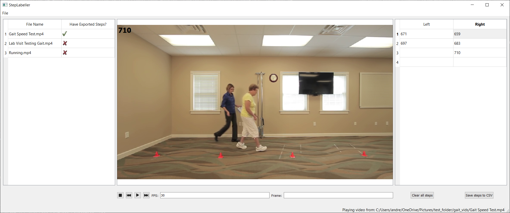

# Step Labeller - A C++/QT application for annotating footfalls in videos
This project provides a simple GUI for manually labelling footfalls in videos. Useful for video-based gait analysis, the detection of footfalls in a key step in traditional (non-machine learning) gait analysis workflows. The goal of this library is to provide an easy-to-use tool for helping individuals annotate ground truth footfall timings in videos. 


The main features of this library include the ability to:  
-  Select a root folder and label all videos in the directory
-  Export the frame number of the left/right footfalls in `.csv` format for use in downstream gait analysis pipelines
-  Specify the playback speed (in fps) or step through the video frame by frame


Video from: https://www.youtube.com/watch?v=JtiTtxfGFOY
## Installation
These instructions have been tested on:
- Ubuntu 20.04 (native), GCC 8.4.0
- Ubuntu 20.04 (WSL2), GCC 9.4.0
- Windows 10 Home build 19044.1586, GCC 10.3.0

### Prerequisites
This library depends on OpenCV and QT5, which must be installed and in the `PATH` before compiling StepLabeller. 

#### OpenCV
Install OpenCV on your machine. You can download a pre-built release (https://github.com/opencv/opencv/releases) or build from source. To build from source you can follow the instructions here: https://linuxize.com/post/how-to-install-opencv-on-ubuntu-20-04/, adapting as needed for Windows.  
Note: You may wish to use `cmake-gui` or `cmake -D` variables to specify the compiler(s) to use to build OpenCV.

Be sure to add the path to the installed library to your `$PATH`! This is required for the StepLabeller project to be able to locate and link against the OpenCV dlls. For example, on my system, the location to the OpenCV dlls is: `%OPENCV_DIR%/install/x64/mingw/bin`, where `%OPENCV_DIR%` would be `~/opencv_build/opencv/build` if you are following the tutorial above. 

#### Qt5
This library has been developed using Qt 5.15.2. It has not been ported or tested using Qt6.   
To install Qt5 on Windows, follow the instructions on the QT website: https://doc.qt.io/qt-5/windows.html
To install Qt5 on Ubuntu, you can simply install the necessary Qt5 dependencies with: 
```
sudo apt install qt5-default qtmultimedia5-dev
```

### Building Step Labeller
After OpenCV and Qt5 are installed and added to the `PATH`, the Step Labeller project can be compiled as follows:  
Clone the repo:

```
git clone https://github.com/andreasabo-ibbme/step_labeller.git
cd step_labeller/
```
Configure the library: 
```
cmake -S . -B build                         # As before, specify any necessary options. 
                                            # Note: you may need to add -DOPENCV_DIR="~/opencv_build/opencv/build" 
                                            # if OPENCV_DIR is not set as an environment variable.
```
Build and install:
```
cmake --build build                     
cmake --install build --prefix .            # This installs in the current directory, but you can change this to build elsewhere
```
Run the executable:
```
./bin/StepLabeller                          # This will be ./bin/StepLabeller.exe on Windows
```

If you find you are getting an error indicating that OpenCV or Qt5 dlls cannot be found, ensure that the locations of these are in the `PATH`. 

If you are able to see a window similar to the one in the picture above, you can move forward to the [usage instructions](docs/usage.md).
