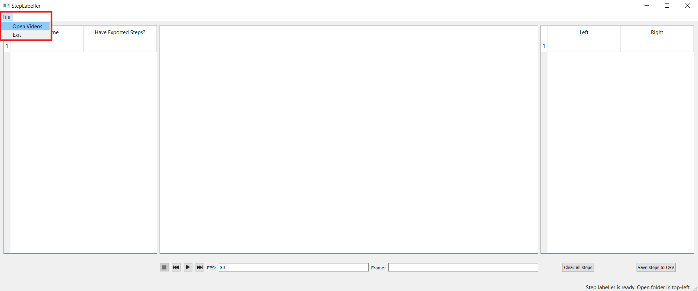
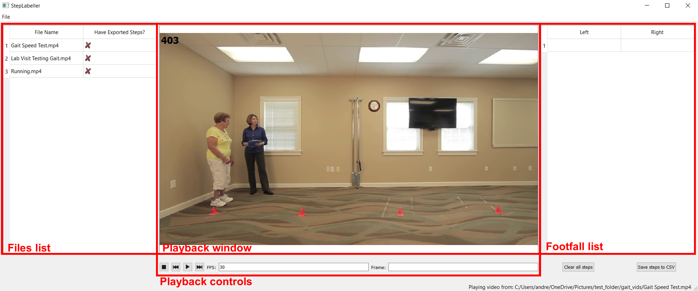

# Step Labeller Usage Instructions

## Select Folder with Videos
After lauching the Step Labeller UI, a folder of videos to label can be selected through the `File\Open Videos` menu in the top-left. Be sure to select a *folder* rather than individual video files. 



## User Interface Components
Upon selecting a folder, the files list and footfall list will populate. The video will start in the playback window in the the center of the screen.


## Labelling Instructions

### Playback control
Video playback can be controlled through either the playback controls under the playback video or through keyboard shortcuts.  
From left to right, the buttons in the playback controls can be used to:
- stop playback
- step back one frame
- pause/play video
- step forward on frame
- select the playback speed (in FPS - default playback speed is 30 fps)
- select the frame to skip to (invalid frame numbers will be ignored)

### Keyboard shortcuts
With the focus on the playback window, the following buttons also can be used to control playback of the video and to label footfalls:
```
Spacebar - pause/play video
A - step back one frame
D - step forward one frame
Q - add current frame to left footfall list
E - add current frame to right footfall list
```

### Changing videos
To label footfalls in another video, use the mouse to left-click the video name in the files list on the left of the UI. 
Note: Any labelled steps in the footfall list will be automatically saved.

### Clearing footfalls
To remove annotations for the current video, the  `Clear all steps` button below the footfall list can be used. If this button is pressed errorneously, the previously saved steps can be recovered by selecting another video and then returning to the current video using the files list on the left of the UI. Once new steps are added after clearing, the previous steps will be overwritten and can no longer be recovered. To clear and preserve the empty footfall list in the saved footfall file on disk, press the `Save steps to CSV` button after clearing the footfalls. 